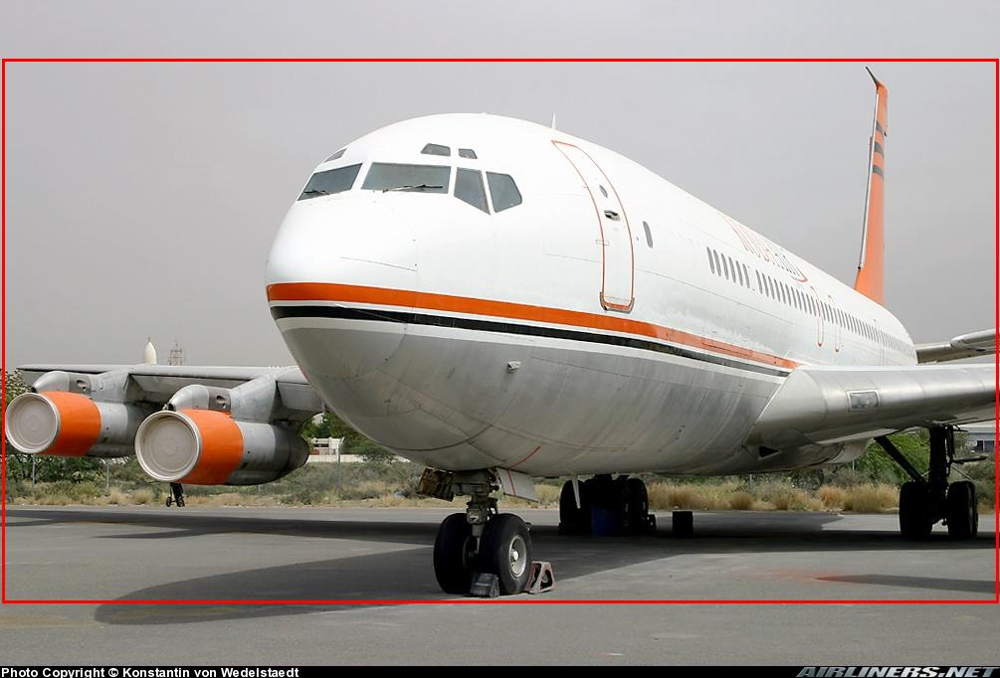

# DiffuseMix : Label-Preserving Data Augmentation with Diffusion Models (CVPR'2024)

[](https://diffusemix.github.io/)
[](https://arxiv.org/pdf/2405.14881)
[]([https://www.linkedin.com/in/khawarislam/](https://www.youtube.com/watch?v=FcM4wgieDmU))
[](https://github.com/khawar-islam/diffuseMix)
[](https://badges.toozhao.com/stats/01HRR1Z1PZQZ9PCVJ7MN2Q67HN "Get your own page views count badge on badges.toozhao.com")


<p align="center">
    
</p>

<p align="center">
    
</p>

---

### 📢 Latest Updates
- **Mar-11-24**: DiffuseMix paper is released [arxiv link](https://arxiv.org/abs/2405.14881). 

### 🚀 Getting Started
Setup anaconda environment using `environment.yml` file.

```
conda env create --name DiffuseMix --file=environment.yml
conda remove -n DiffuseMix --all # In case environment installation faileds
```

### 📝 List of Prompts 
Below is the list of prompts, other_prompts are the new prompts we tested.

```
prompts = ["Autumn", "snowy", "watercolor art","sunset", "rainbow", "aurora",
               "mosaic", "ukiyo-e", "a sketch with crayon"]

other_prompts= ["Pointillism", "sepia", "etching", "twilight", "grainy film texture",
            "spring bloom", "stormy sky", "pixel art", "golden hour"]          
```

### 📁 Dataset Structure
```
aircraft_100cls
train
 └─── class 1
          └───── 0056978.jpg
 └─── class 2
          └───── 0054367.jpg
 └─── ...
```

### 🎶 Examples of Result
```
data_example
diffuseMix or diffuseMix_bbox
 └─── original
          └───── 0743290_dmix_0.jpg
 └─── other_prompts
          └───── 0817494_dmix_0.jpg
 └─── ...
```
<p align="center">
    
</p>

<p align="center">
    
</p>

### ✨ DiffuseMix Augmentation
To introduce the structural complexity, you can download fractal image dataset from here [Fractal Dataset](https://drive.google.com/drive/folders/1uxK7JaO1NaJxaAGViQa1bZfX6ZzNMzx2?usp=sharing)
```
python3 main_prompt.py --train_dir PATH --fractal_dir PATH --out_dir PATH --device 0
python3 main_bbox.py --train_dir PATH --fractal_dir PATH --out_dir PATH --device 0 --bbox_file IMAGES_BOX.TXT PATH
```

### 💬 Citation
```
@article{diffuseMix2024,
  title={DIFFUSEMIX: Label-Preserving Data Augmentation with Diffusion Models},
  author={Khawar Islam, Muhammad Zaigham Zaheer, Arif Mahmood, Karthik Nandakumar},
  booktitle={Proceedings of the IEEE/CVF Conference on Computer Vision and Pattern Recognition (CVPR)},
  year={2024}
}
```
